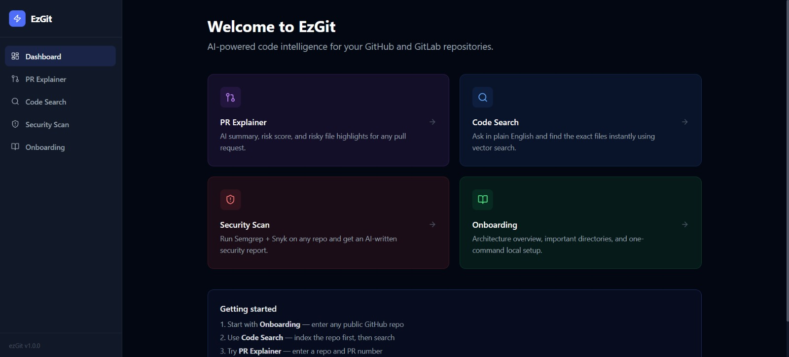
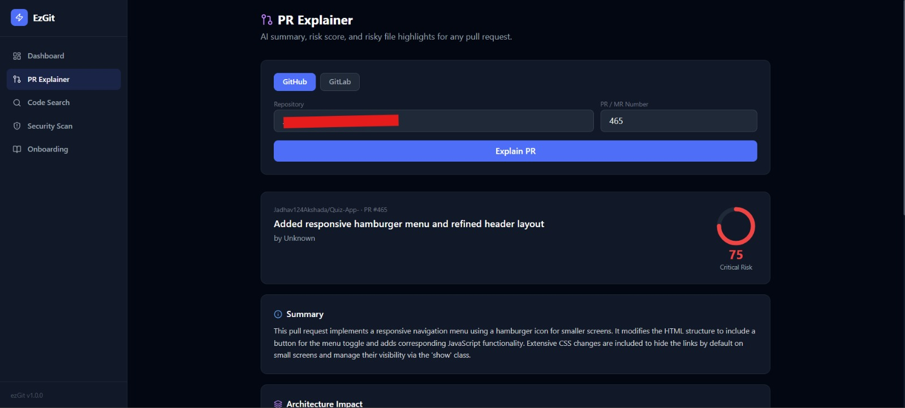
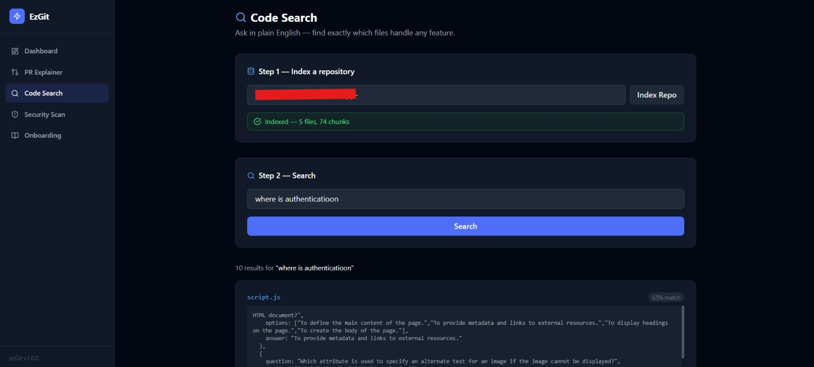
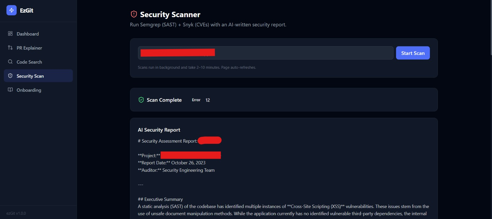
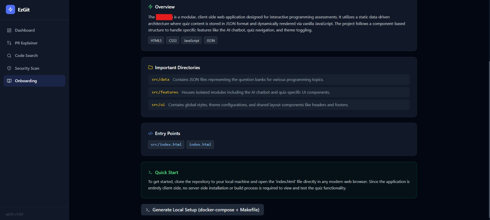

# EzGit - AI-Powered Code Intelligence

Understand any GitHub or GitLab repository instantly. Explain PRs, search code in plain English, scan for vulnerabilities, and onboard to new codebases in minutes.

## Features

- **PR Explainer** - AI summary, risk score 0-100, risky file highlights for any pull request
- **Code Search** - Natural language search over indexed codebases using pgvector
- **Security Scanner** - Async Semgrep + Snyk scan with AI-written security report
- **Onboarding** - Architecture overview, important directories, one-command local setup

## Tech Stack

| Layer       | Technology                                  |
|-------------|---------------------------------------------|
| Frontend    | React 18, TypeScript, Tailwind CSS, Vite    |
| Backend     | Python 3.11, FastAPI, Celery                |
| Database    | PostgreSQL 16 + pgvector extension          |
| Cache/Queue | Redis 7                                     |
| AI          | Gemini 2.0 Flash Lite + Gemini Embeddings   |
| Security    | Semgrep (SAST) + Snyk (CVE scanning)        |
| Source      | GitHub API + GitLab API                     |
| Infra       | Docker + Docker Compose                     |

## Screenshots

## Getting Started

### Prerequisites

- Docker Desktop (used only for PostgreSQL + Redis)
- Python 3.11+ (3.13 works with the current pinned dependencies)
- Node.js 18+
- Git

### Setup (Windows quick start)

Clone the repo:

    git clone https://github.com/R2-STAR/EzGit.git
    cd EzGit

Create your environment file and fill in your API keys (see the API Keys table below):

    Copy-Item backend\.env.example backend\.env

Start everything (databases, API, Celery worker, frontend) in the background:

    .\start.ps1

Or start manually, databases first:

    docker compose up -d postgres redis

then, in three separate terminals (run from the repo root):

    cd backend; .venv\Scripts\python -m uvicorn app.main:app --host 0.0.0.0 --port 8000 --reload
    cd backend; .venv\Scripts\python -m celery -A app.workers.tasks worker --loglevel=info --pool=solo
    cd frontend; npm run dev

The first run creates the backend venv and installs dependencies automatically
(via `start.ps1`, or manually with `python -m venv backend\.venv`, `pip install -r
requirements.txt`, and `npm install`).

> Note: PostgreSQL is mapped to host port **5433** to avoid conflicts with other
> local Postgres installs. The Celery worker uses `--pool=solo`, which is required
> on Windows (the default `prefork` pool crashes with `WinError 5`).

Open your browser:

    Frontend  →  http://localhost:5173
    Backend   →  http://localhost:8000
    API Docs  →  http://localhost:8000/docs

### Running everything with Docker (Linux/macOS)

    cp backend/.env.example backend/.env
    make setup   # or: docker compose up -d --build

## Daily Commands

    # Start everything (databases + app)      .\start.ps1
    # Start app only (DBs already running)    .\start.ps1 -SkipDocker
    # Stop app (keeps databases running)      .\stop.ps1
    # Stop app + databases                    .\stop.ps1 -AlsoDocker
    # View app logs                           Get-ChildItem .logs
    # Docker-only: start                      docker compose up -d postgres redis
    # Docker-only: stop                       docker compose down
    # Full reset (drop DB data)               docker compose down -v

## API Keys Required

Copy `backend/.env.example` to `backend/.env` and fill in the values:

| Key              | Where to get                                                                                                     | Scopes / notes                                        |
|------------------|------------------------------------------------------------------------------------------------------------------|-------------------------------------------------------|
| `GITHUB_TOKEN`   | github.com → avatar → Settings → Developer settings → Personal access tokens → Tokens (classic) → Generate new token | `repo`, `read:org`. Starts with `ghp_...`             |
| `GEMINI_API_KEY` | https://aistudio.google.com/app/apikey → Create API key                                                            | Starts with `AIza...`                                 |
| `SNYK_TOKEN`     | https://app.snyk.io → avatar → Account settings → API token → COPY                                                 | Needed for the Security Scanner feature               |
| `GITLAB_TOKEN`   | (optional) gitlab.com → avatar → Preferences → Access Tokens                                                       | `read_api`, `read_repository`. Only for GitLab repos  |

## Project Structure

    EzGit/
    backend/
        app/
            api/        HTTP route handlers
            services/   Gemini, GitHub, GitLab, Semgrep, Snyk
            workers/    Celery async tasks
            db/         Postgres, Redis, pgvector
            models/     Pydantic schemas
    frontend/
        src/
            api/        Axios API calls
            hooks/      React Query hooks
            pages/      5 pages
            components/ Reusable UI components
